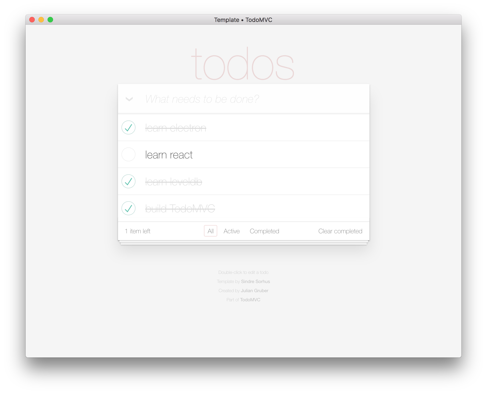

# TodoMVC-React-LevelDB-Electron

Implementation of the popular [TodoMVC](http://todomvc.com/) project using the triumvirate of:

- [React](https://reactjs.org/)
- [LevelDB](http://leveldb.org/)
- [Electron](https://electronjs.org/)

This is a very short implementation - possibly the shortest - consisting of only 177 lines of JavaScript.

[Check out the source!](src/index.js)

## Screenshot



## Getting started

```bash
$ npm install
$ npm run rebuild
$ npm watch &
$ npm start
```

## License

MIT
